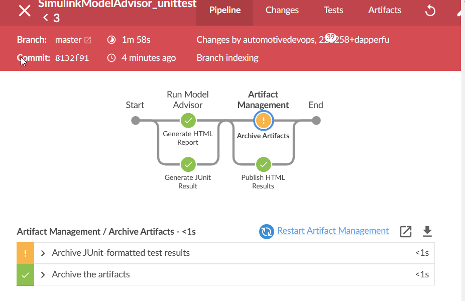
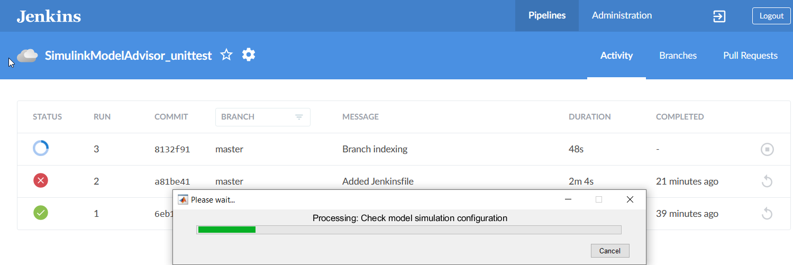
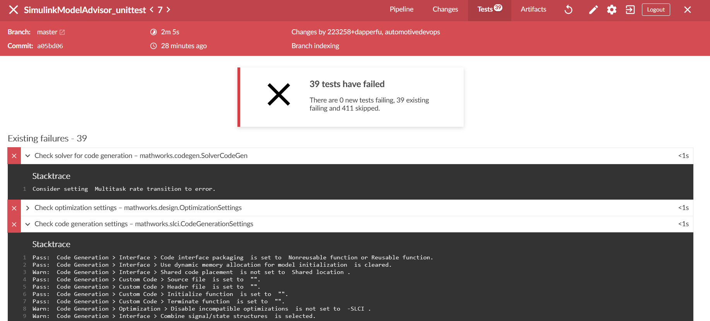
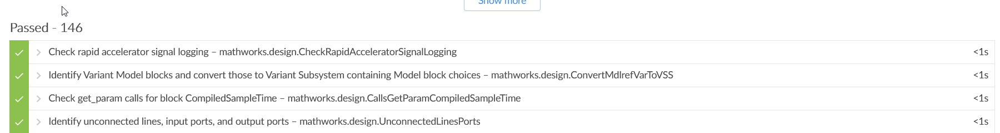
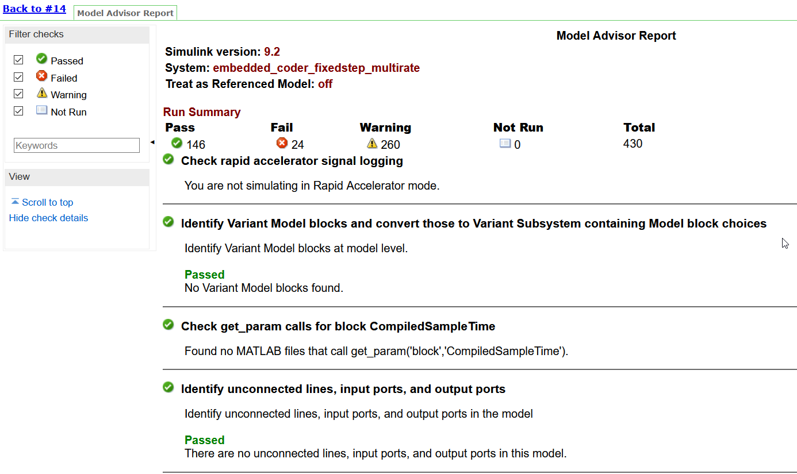

1. [What is CI/CD? Continuous integration and continuous delivery explained](https://www.infoworld.com/article/3271126/what-is-cicd-continuous-integration-and-continuous-delivery-explained.html)
2. For this example Jenkins is used as the CI/CD tool but the concepts and tools should apply to any backend such as [GitLab Runner](https://docs.gitlab.com/runner/install/windows.html).

# # Jenkins Simulink Model Advisor

Working proof-of-concept examples on how to add Simulink Model Advisor checks to your devops CI/CD pipeline. This fully automates execution of Simulink Model Advisor.

The `Jeninsfile` executes two Matlab scripts in parallel.

- [model_advisor_HTML.m](model_advisor_HTML.m) generates a HTML report
- [model_advisor_XML.m](model_advisor_XML.m) generates a JUnit XML report 

In addition to being archived on Jenkins the Test reports can be published to S3, Windows Shared Drives, notified through Slack, or any other supported Jenkins plugin notification & artifact plugin. The HTML results can also be published to GitHub Pages as shown: https://dapperfu.github.io/Jenkins-Simulink-Model-Advisor/

## Jenkins Pipeline View:

This is the Pipeline view of this project. The HTML and JUnit report generation are executed in parallel. The artifacts are then archived and processed.

Example screenshot of Model Advisor running with Jenkins BlueOcean page in the background.

# Model Advisor -> JUnit Results Display

The [model_advisor_XML.m](model_advisor_XML.m) script converts the Model Advisor results to a JUnit compliant XML file. The Archive JUnit Results step consumes the generated XML. These results  can then natively displayed directly from Jenkins as shown below.

Failed Tests: (Model Advisor Warnings are treated as failures in the [model_advisor_XML.m](model_advisor_XML.m) script)

Passed Tests:

# Jenkins Artifacts

Web view of the artifacts page with each archived artifact. 

# Model Advisor HTML Report Display

The Publish HTML Jenkins plugin allows you to publish HTML files for viewing directly from the Artifacts page. The "Model Advisor Report" link on the Artifacts page (above) will take you to the report as published from Model Advisor.

